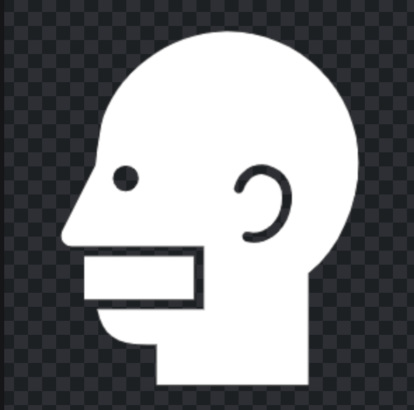

<!-- PROJECT SHIELDS -->
[![LinkedIn][linkedin-shield]][linkedin-url]


<!-- PROJECT LOGO -->
<br />
<p align="center">
  <a href="https://github.com/othneildrew/react-gallery-app">
    
  </a>

  <h3 align="center">The GAG Reel</h3>

  <p align="center">
    A fun gallery app created with React and the Flickr API
    <br />
    <a href="https://github.com/othneildrew/react-gallery-app/issues">Report Bug</a>
    ·
    <a href="https://github.com/othneildrew/react-gallery-app/issues">Request Feature</a>
  </p>
</p>


<!-- TABLE OF CONTENTS -->
## Table of Contents

* [About the Project](#about-the-project)
  * [Built With](#built-with)
* [Getting Started](#getting-started)
* [Changes Made](#changes-made)
* [Contributing](#contributing)
* [License](#license)
* [Contact](#contact)


<!-- ABOUT THE PROJECT -->
## About The Project

[![The GAG Reel][product-screenshot]](https://github.com/othneildrew/react-gallery-app)

The GAG Reel is a simple photo gallery app focused on showcasing guns, airplanes, and guitars. However, you can search millions of images available using the Flickr API. This project is part of [Treehouse's Full Stack JavaScript Techdegree](https://join.teamtreehouse.com/full-stack-javascript-techdegree). The project uses React and the Flickr API.

### Built With

* [Flickr API](https://www.flickr.com/services/api)
* [React](https://reactjs.org)


<!-- GETTING STARTED -->
## Getting Started

To get a local copy of the project up and running, follow these simple steps:

1. Obtain a Flickr API Key from [https://www.flickr.com/services/apps/create/apply](https://www.flickr.com/services/apps/create/apply)
2. Clone the repo
```sh
git clone https:://github.com/othneildrew/react-gallery-app.git
```
3. Install Node packages
```sh
npm install
```
4. Add API key to `config.js` file
```sh
const apiKey = 'your_api_key_here';
export default apiKey;
```
5. Move to project folder & start node server
```sh
npm start
```
6. Enjoy, it's that simple! :smile:

_For information regarding the Flickr API visit: [https://www.flickr.com/services/api](https://www.flickr.com/services/api)_


<!-- CHANGES MADE -->
## Changes Made

* Wrote all JavaScript and React functionality
* Created logos
* Changed background and text colors


<!-- CONTRIBUTING -->
## Contributing

Contributions are what make the open source community such an amazing place to be learn, inspire, and create. Any contributions you make are **greatly appreciated**.

1. Fork the Project
2. Create your Feature Branch (`git checkout -b feature/AmazingFeature`)
3. Commit your Changes (`git commit -m 'Add some AmazingFeature`)
4. Push to the Branch (`git push origin feature/AmazingFeature`)
5. Open a Pull Request


<!-- LICENSE -->
## License

Distributed under the MIT License. See `LICENSE` for more information.


<!-- CONTACT -->
## Contact

Othneil Drew - [LinkedIn](https://linkedin.com/in/othneildrew) - codeguydrew@gmail.com

Project Link: [https://github.com/othneildrew/Express-Portfolio](https://github.com/othneildrew/Express-Portfolio)


<!-- MARKDOWN LINKS & IMAGES -->
[license-shield]: https://img.shields.io/badge/license-MIT-blue.svg?style=flat-square
[license-url]: https://choosealicense.com/licenses/mit
[linkedin-shield]: https://img.shields.io/badge/-LinkedIn-black.svg?style=flat-square&logo=linkedin&colorB=555
[linkedin-url]: https://linkedin.com/in/othneildrew
[product-screenshot]: ./public/project-screenshot.png
